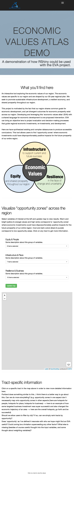

README
================
Ellen Esch
10 April 2021

-   [Overview](#overview)
-   [MetCouncil’s contributions](#metcouncils-contributions)
    -   [Set user parameters](#set-user-parameters)
    -   [Read and process raw data](#read-and-process-raw-data)
-   [Edit and add any region-specific
    langauge](#edit-and-add-any-region-specific-langauge)
-   [Launch the app](#launch-the-app)

## Overview

The Economic Values Atlas project arises from work done by Oregon Metro
and Brookings Institution.

## MetCouncil’s contributions

We have tried to make an RShiny application that is highly portable,
well documented, and requires minimal coding in order to lower the bar
for other regions who might like to implement this type of analysis.

At the most basic level, users may upload an Excel document containing 2
sheets. Users can also leverage R scripts to aggregate disparate data
sources.

### Set user parameters

First, set the following parameters which indicate the state/s and
county/ies from which tract data comes from. Right now, this code is set
to handle up to 2 states although this can easily be expanded if there
is a need. Also set the metro name, and the format of the data inputs.

``` r
state_1 <- "OR"
county_1 <- c("Clackamas", "Columbia", "Multnomah", "Washington", "Yamhill")

state_2 <- "WA"
county_2 <- c("Clark", "Skamania")

metro <- "pdx"
dataformat <- "excel"

#####

# state_1 <- "MN"
# county_1 <- c("Anoka", "Carver", "Dakota", "Hennepin", "Ramsey", "Scott", "Washington")

# metro <- "msp"
# dataformat <- "rscript"
```

### Read and process raw data

If the data is in an excel format, please ensure it has the following
structure:

-   `Sheet 1`: this sheet should be a “variable key” and contain the
    following columns:
    -   `variable`: a short code corresponding to the tract-level data
        used in the EVA
    -   `name`: a descriptive name corresponding to the tract-level data
    -   `type`: indicating if the variable corresponds to `people`,
        `place`, or `business`
    -   `interpret_high_value`: use `high_opportunity` if a high value
        of the variable should correspond to a positive economic value.
        use `low_opporunity` if a high value of the variable is not a
        desirable economic value.
-   `Sheet 2`: this sheet should contain the raw data
    -   `tract_string`: should be the tract identifiers
    -   all other columns should be named according to the `variable`s
        in sheet 1.

The excel file should be placed in the `data-raw` folder. It should be
named according the the following convention: `metro.xlsx`. (Notice that
Portland Metro’s data had a different format/structure, so I processed
that data differently; the suggested format here should hopefully save
you from Excel headaches!)

If an R script is being used to aggregate the data, you may find it
useful to follow the example for the Twin Cities outlined in the
`input_tract_data.R` script.

## Edit and add any region-specific langauge

There will likely be region-specific information that should be
displayed alongside the data within the interactive application. A
general shell is created here. But users should edit the
`./R/mod_home.R` script for any introductory information which should be
displayed. And the `./R/app_ui/R` script can be edited as well.

Text and pictures may also be updated, and the interface can be styled
with css. I’m not sure of the best way to make that portable. My
inclination is to create a “Brookings” style for the generic app.

## Launch the app

The following code will launch your region’s app (!!). To deploy it on
an R server, you can click the blue button on the top right hand side of
the app that will launch locally.

``` r
pkgload::load_all(export_all = FALSE, helpers = FALSE, attach_testthat = FALSE)
options("golem.app.prod" = TRUE)
eva.app::run_app() # add parameters here (if any)
```

    ## [1] "rendering polygons"
    ## character(0)

    ## [1] "nodata"

    ## [1] "nodata"

<!-- -->
